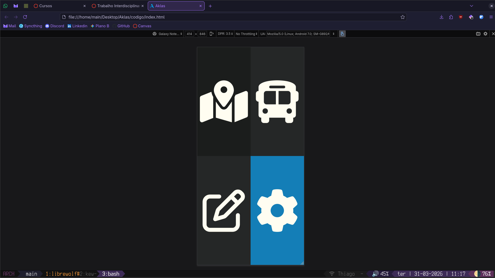

# Aklas - Assistência de pessoas cegas em ônibus

A ideia central do projeto é dar assistência a pessoas com deficiência visual a usar o transporte público. Seria um app mobile, onde a tela seria divida em quadrantes que falam em voz alta para o usuário, antes dele realmente tomar decisões. O aplicativo iria ser um GPS para caminhada, espera, embarcação e descida de transporte público, usando um apito para alertar o usuário caso seu ônibus estivesse chegando ao ponto, e dizendo direções a se seguir em ordem de alcançar o ponto. O aplicativo também contaria com um sistema de anotações por voz.

Este é um projeto que nosso grupo fez no primeiro semestre do curso (2023/2) para a matéria de TI1. Escolhemos o nome 'Aklas' na época por significar 'cego' em Lithuniano e se assemelhar a 'Atlas' (já que o projeto envolveria um mapa). Mas após anos de reconsideração, podemos sim assumir que o escopo do projeto era demais para alunos do primeiro semestre, e não seria possível fazer algo de qualidade sem o uso de Flutter e APIs. Além de que seria mais indicado conseguirmos entrevistar a pessoas com necessidade de acessibilidade visual, para validar a qualidade do produto (além do nome não ser exatamente agradável na língua).

Ele está indeterminadamente em Hiato, mas pode sim voltar, caso alguém queira o reimplementar usando as novas tecnologias que temos acesso.

## Alunos integrantes da equipe

* Augusto Vinícios Vilar Sette
* Júlio César Araújo Biluca
* Matheus Eduardo Campos Soares
* Thiago Pereira de Oliveira

## Professores responsáveis

* Rommel Carneiro

